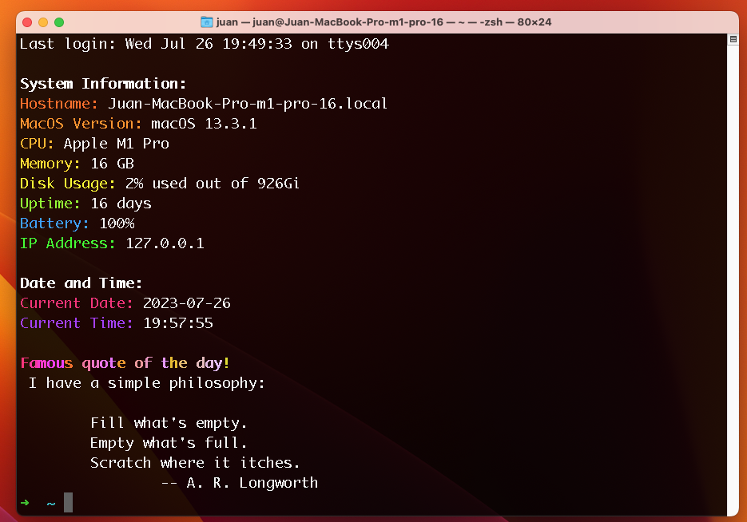

# oldschool-prompt-beautifier
Macos Ventura oldschool prompt beautifier

This is the prompt beautifier I designed to work with .zsh in MacOs Ventura.

It shows System information, date and time, and a random quote, all with vivid and nice colors. It makes me remember the sweet old times of programming and un*x.

In order to make it work you should :

1. Install Zsh and make it your default shell.
2. Install Oh my sh ( optional and not required, but suggested as you can see in the final prompt )
3. Install with Fortune: brew install fortune
4. Create this .sh file inside some folder in your home.
5. Make it executable with +x command
6. Add to your .zshrc file with something like: echo "oldschool-prompt-beautifier.sh" >> .zshrc
7. Enjoy the amazing old times in your console ! :)
